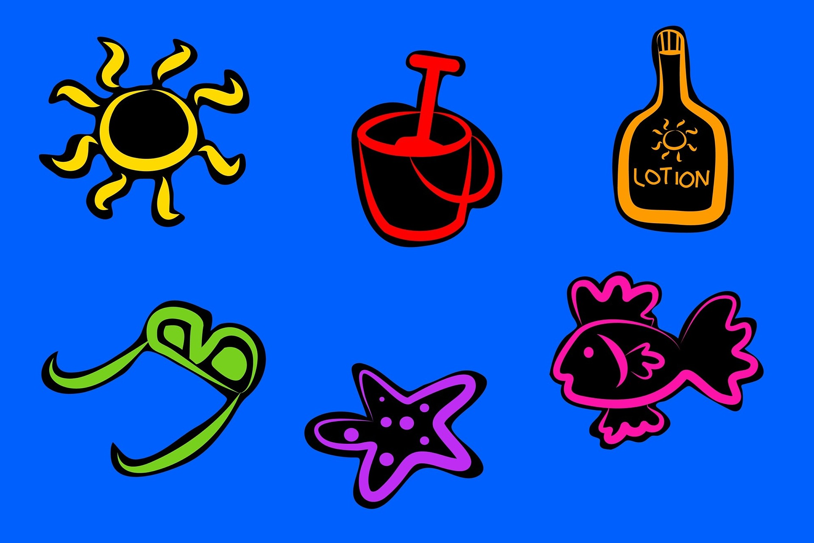

# Introduzione

Javascript è un linguaggio **di scripting orientato agli oggetti e agli eventi** comunemente usato nella **programmazione web lato client.** Vediamo cosa significa questo:‌

Javascript è un linguaggio **di scripting orientato agli oggetti e agli eventi** comunemente usato nella **programmazione web lato client.**  Vediamo cosa significa questo:

**è un linguaggio di scripting:** è un linguaggio di programmazione interpretato **dal browser** 

\(chrome**,** firefox, IE, Safari, Opera\)   

 **orientato agli oggetti:** ossia permette di definire dei componenti  che hanno uno **stato ed un comportamento**    

  **orientato agli eventi:**  ossia non è un programma lineare dove parte e svolge determinate istruzioni fino alla fine del programma ma esegue le istruzioni in base a quello che succede nella pagina ad esempio se l'utente **clicca su un pulsante** succederà qualcosa se invece passa con il mouse sopra un'immagine succederà qualcos'altro e così via.  

**lato client:**   significa che viene interpretato direttamente sul computer finale dell'utente  e non da un server.  

**è un linguaggio di scripting:** è un linguaggio di programmazione interpretato **dal browser**‌

\(chrome**,** firefox, IE, Safari, Opera\) ‌

 **orientato agli oggetti:** ossia permette di definire dei componenti che hanno uno **stato ed un comportamento** ‌

 **orientato agli eventi:** ossia non è un programma lineare dove parte e svolge determinate istruzioni fino alla fine del programma ma esegue le istruzioni in base a quello che succede nella pagina ad esempio se l'utente **clicca su un pulsante** succederà qualcosa se invece passa con il mouse sopra un'immagine succederà qualcos'altro e così via. ‌

**lato client:** significa che viene interpretato direttamente sul computer finale dell'utente e non da un server.Last updated 13 minutes ago  

