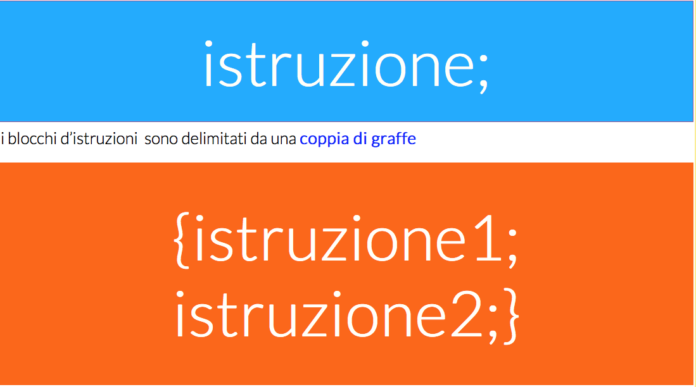

# Sintassi

## Sintassi

Il codice JavaScript è composto da una **sequenza di istruzioni che viene interpretata ed eseguita dall’engine.**  Ciascuna i**struzione \(o blocco di istruzioni\)** **è delimitata da un punto e virgola.**  



 è un linguaggio **keys sensitive** ossia fa distinzione tra **maiuscole minuscole.**

### **Inserire codice JavaScript in una pagina HTML**

Esistono tre modi per inserire codice JavaScript in una pagina HTML:

* **inserire codice inline;**
* **scrivere blocchi di codice nella pagina;**
* **importare file con codice JavaScript esterno.**

### Codice inline

L’inserimento di codice inline, consiste nell’inserire direttamente le istruzioni JavaScript nel codice di un elemento HTML, assegnandolo **ad un attributo che rappresenta un evento**. Chiariamo il concetto con un esempio:

`<button type="button" onclick="alert('Ciao Mondo!')">Cliccami</button>`

**L’attributo onclick** rappresenta l’evento del **clic sul pulsante del mous**e, quindi in corrispondenza di questo evento verrà analizzato ed eseguito il codice JavaScript assegnato.  

```javascript
function prova(){
alert("prova alert");
}

```

